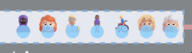
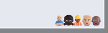

## Step-by-step guide for SimPy

### Step 1. Back up your existing model!

Before adding Vidigi to your model, make sure to **back up your current version first**.

While vidigi has been tested to ensure that it's special resource classes work the same as existing SimPy resource classes, it's still possible to accidentally change your model. There's also a chance that the vidigi classes don't work identically to SimPy classes in more complex scenarios with reneging, baulking, or other conditional logic around resource allocation.

Therefore, it's highly advisable to **check the key output metrics from your model before and after incorporating vidigi**!

Even better, consider writing some formal [backtests]() with pytest or your preferred testing framework.


### Step 2. Log arrivals, queues, and departures

At its simplest, vidigi needs to know three things about each entity to be able to create an animation:

- when they arrived
- when they started an event
- when they left

Vidigi has support for two key event types: queues, and resource use.

:::: {.columns}

::: {.column width='50%'}
### Queues

In a queue, entities will move from left to right across the screen as the people in front of them leave the event. This is the default; passing `queue_direction="right"` (or setting it per event) mirrors the queue so it builds out to the *right* of its anchor instead, which reads better with entity emojis that face right — see [Step 3](#step-3-determining-event-positioning-in-the-animation).



:::

::: {.column width='50%'}
### Resource Use

When resource use event types are added, entities will go to a particular resource and stay in that position until the event completes, as well as displaying an icon for each individual resource at all times throughout the simulation. This makes it easier to see how long that resource is busy with that entity, and how many resources are in use or idle at each stage



:::

::::


::: {.callout-tip}

When setting up your first animation, we would recommend just using queues to begin with.

This allows you to create a basic animation quickly and easily, with minimal changes to your code.

You can then easily swap out queues for resource use once you have the core model layout and structure implemented.


:::


We would recommend using the `EventLogger` class to record key moments.

```{.python}
from vidigi.logging import EventLogger

logger = EventLogger(env=env, run_number=1)
```

For arrivals and departures you only need the entity ID; for queues you also provide an event name; for resource use (start and end) you provide an event name and a resource identifier so vidigi can track which specific resource is in use. These arrival and departure events are used to decide when entities first appear and finally leave the animation; missing departures will slow things down as the log grows indefinitely.

You can capture these using `EventLogger`:

| When | Method |
| - | - |
| Entity arrives | `logger.log_arrival(entity_id)` |
| Starts waiting | `logger.log_queue(entity_id, event="wait_for_nurse")` |
| Starts using resource | `logger.log_resource_use_start(entity_id, event="nurse_begins", resource_id)` |
| Finishes using resource | `logger.log_resource_use_end(entity_id, event="nurse_ends", resource_id)` |
| Leaves | `logger.log_departure(entity_id)` |

This will create an event log in the required format for vidigi's animation functions - for example:

| patient | event_type        | event                    | time | resource_id |
|---------|-------------------|--------------------------|------|-------------|
| 15      | arrival_departure | arrival                  | 1.22 |             |
| 15      | queue             | enter_queue_for_bed      | 1.35 |             |
| 27      | arrival_departure | arrival                  | 1.47 |             |
| 27      | queue             | enter_queue_for_bed      | 1.58 |             |
| 12      | resource_use_end  | post_surgery_stay_ends   | 1.9  | 4           |
| 15      | resource_use      | post_survery_stay_begins | 1.9  | 4           |

:::


::: {.callout-tip}
If you are adding vidigi to an existing model, you may have already created some form of logging for your animation.

The animation functions take a dataframe, not an EventLogger object, so as long as your
:::


### Step 3. Determining event positioning in the animation

You need to tell vidigi where each queue and resource should appear in the animation. The easiest way is to create a DataFrame with one row per event position. The minimum required columns are:

* `event`: Must match the event name used in the event log.
* `x`: X co-ordinate of the event for the animation. This will correspond to the bottom-right hand corner of a queue, or the rightmost resource (or the bottom-*left* corner / leftmost resource when that event builds to the right — see `direction` below).
* `y`: Y co-ordinate of the event for the animation. This will correspond to the lowest row of a queue, or the central point of the resources.
* `label`: Text label for the stage. This can be hidden at a later step if you opt to use a background image with labels built-in. Use `<br>` for line breaks.
* `direction` (optional): `"left"` (the default) builds the queue out to the left of `x`; `"right"` builds it out to the right, mirroring the layout so the anchor becomes the bottom-left corner. Leave it unset to follow the animation-wide `queue_direction`.

Vidigi provides helper classes and functions for setting this up. For SimPy or manually created logs, we need to make sure the `event` name matches the event log:

```{.python}
from vidigi.utils import create_event_position_df, EventPosition

event_position_df = create_event_position_df([
    EventPosition(event="arrival", x=50, y=450, label="Arrival"),
    EventPosition(event="treatment_wait_begins", x=205, y=275,
                  label="Waiting for Treatment"),
    EventPosition(event="treatment_begins", x=205, y=175,
                  label="Being Treated"),
    EventPosition(event="depart", x=270, y=70, label="Exit"),
])
```

By default every queue builds out to the left of its anchor. To flip the whole
animation, pass `queue_direction="right"` to `animate_activity_log()` (or
`generate_animation_df()` / `generate_animation()`). To flip just one stage,
give that `EventPosition` its own `direction`:

```{.python}
event_position_df = create_event_position_df([
    EventPosition(event="arrival", x=50, y=450, label="Arrival"),
    EventPosition(event="treatment_wait_begins", x=205, y=275,
                  label="Waiting for Treatment", direction="right"),
    EventPosition(event="treatment_begins", x=205, y=175,
                  label="Being Treated"),
    EventPosition(event="depart", x=270, y=70, label="Exit"),
])
```

A per-event `direction` always wins over the animation-wide `queue_direction`.
Stage labels automatically move to the clear side of a right-building queue.

:::{.callout-note collapse="true"}
### Click to see how we'd do this with a dictionary instead

If you prefer not to use the helpers, you can create the DataFrame directly from a list of dictionaries:

```{.python}
event_position_df = pd.DataFrame([
    # Triage
    {"event": "triage_wait_begins",
     "x": 160, "y": 400, "label": "Waiting for<br>Triage"},
    {"event": "triage_begins",
     "x": 160, "y": 315, "resource": "n_triage", "label": "Being Triaged"},

    # Trauma pathway
    {"event": "TRAUMA_stabilisation_wait_begins",
     "x": 300, "y": 560, "label": "Waiting for<br>Stabilisation"},
    {"event": "TRAUMA_stabilisation_begins",
     "x": 300, "y": 500, "resource": "n_trauma", "label": "Being<br>Stabilised"},

    {"event": "TRAUMA_treatment_wait_begins",
     "x": 630, "y": 560, "label": "Waiting for<br>Treatment"},
    {"event": "TRAUMA_treatment_begins",
     "x": 630, "y": 500, "resource": "n_cubicles", "label": "Being<br>Treated"},

    {"event": "depart",
     "x": 670, "y": 330, "label": "Exit"},
])
```
:::

### Step 4. Create the animation

There are two main ways to create the animation:

* Use the **one-step** function `animate_activity_log()`
    See [this simple example](../examples/example_1_simplest_case/ex_1_simplest_case.ipynb) or [this slightly more complex example](../examples/example_2_branching_multistep/ex_2_branching_multistep_case.ipynb) for a demonstration of this.

* Use `reshape_for_animations()`, `generate_animation_df()` and `generate_animation()` separately, passing the output of each to the next step. This allows more customisation (for example different icons for different patient classes).
    See [this priority queueing example](../examples/example_3_simplest_case_priority_resource/ex_3_simplest_case_priority_resource.ipynb) for a demonstration of this.

Both functions take the same set of appearance arguments - background colour and image, icon sizes, stage labels, spacing, playback speed and more. See [Customising the animation](/vidigi_docs/customising_animations.qmd) for the full list grouped by what each one changes.


## Adding details of resource use


### Step 5. Replace your resources

SimPy resources need to be replaced with SimPy stores containing resources that carry a custom `.id` (also available under its older name `.id_attribute`), so that vidigi can track which specific resource each entity uses. This can have wider benefits for monitoring individual resource utilisation within your model as well.

Vidigi provides two helper classes to support with this: `VidigiStore` and `VidigiPriorityStore`.

**Replace this:**

```{.python}
nurses = simpy.Resource(env, capacity=5)
```

**With this:**

```{.python}
from vidigi.resources import VidigiStore

nurses = VidigiStore(env, num_resources=5, label="nurse")
```

Always pass a `label` that is unique to this pool of resources. Each `VidigiStore` numbers its own resources `1, 2, 3, ...`, so if your model has more than one pool (for example `nurses` and `treatment_cubicles`), two different physical resources can end up sharing the same `resource_id`. `label` gives each resource a `.unique_id` (e.g. `"nurse_1"`; also available as `.unique_id_attribute`) that stays distinct across pools, which matters if you want to analyse individual resource utilisation later with `vidigi.analysis.resource_utilisation(by="resource")`. Omitting `label` still works today but emits a `DeprecationWarning` - it is expected to become mandatory in a future major version.

If your model needs each resource to carry extra information - a staff type for break scheduling, a skill grade, a home location - pass `extra_attributes`:

```{.python}
nurses = VidigiStore(env, num_resources=5, label="nurse",
                     extra_attributes={"staff_type": "nurse"})
# every resource in the pool now has `.staff_type == "nurse"`
```

Your model code reads these back off the resource it is handed (`resource.staff_type`); vidigi itself ignores them. The same applies to `populate_store()` and `VidigiPriorityStore`.

This becomes slightly more complex with conditional requesting (for example, where a resource request is made but if it cannot be fulfilled in time, the requester will renege). This is covered to some extent in some of the provided examples, but further demonstrations of this are planned.


### Step 6. Log resource use


We can now swap

| When | Method |
| - | - |
| Starts using resource | `logger.log_resource_use_start(entity_id, event="nurse_begins", resource_id)` |
| Finishes using resource | `logger.log_resource_use_end(entity_id, event="nurse_ends", resource_id)` |

This will create an event log in the required format for vidigi's animation functions - for example:

| patient | event_type        | event                    | time | resource_id |
|---------|-------------------|--------------------------|------|-------------|
| 15      | arrival_departure | arrival                  | 1.22 |             |
| 15      | queue             | enter_queue_for_bed      | 1.35 |             |
| 27      | arrival_departure | arrival                  | 1.47 |             |
| 27      | queue             | enter_queue_for_bed      | 1.58 |             |
| 12      | resource_use_end  | post_surgery_stay_ends   | 1.9  | 4           |
| 15      | resource_use      | post_survery_stay_begins | 1.9  | 4           |

::: {.callout-tip}
## A simpler way to log resource use

If you're using `VidigiStore` or `VidigiPriorityStore`, you don't have to call `log_resource_use_start`/`log_resource_use_end` by hand as shown above. Pass `logger=` when you create the store, then `entity_id=` when you request a resource, and both events are logged for you automatically. See [Automatic resource-use logging](basic_example_with_vidigi_logger_helpers_multiple_servers.qmd#automatic-resource-use-logging) for a worked example.
:::


### Step 7. Ensure you have a class with resource counts

When you later define event positions for `resource_use` steps, you will also need to provide an identifier for the resource (for example a parameter such as `n_treatment_cubicles`) so vidigi knows how many resources to draw at that step. This, in turn, requires a small class or object to hold your resource counts that you can pass into the animation function.

```{.python}
class ModelParams:
    def __init__(self):
        self.n_triage_resources = 3
        self.n_treatment_cubicles = 5


params = ModelParams()
```


::: {.callout-tip}
If you are following the [HSMA SimPy structure](https://des.hsma.co.uk/), this object will usually be your `g` class.

If you are following the [DES RAP Book structure](https://pythonhealthdatascience.github.io/des_rap_book/), this object will usually be your `Params` class.

Otherwise, you can create a simple parameters class to hold your resource counts and pass it to the animation function:
:::


### Step 8. Update your


* `resource` (optional): Only needed if the step is a `resource_use` step. This should match an attribute name on the `scenario` object passed to `animate_activity_log()` and give the number of resources at that step.

Here, we've added the 'resource' parameter to our `EventPosition` for `treatment_begins`.

```{.python}
from vidigi.utils import create_event_position_df, EventPosition

event_position_df = create_event_position_df([
    EventPosition(event="arrival", x=50, y=450, label="Arrival"),
    EventPosition(event="treatment_wait_begins", x=205, y=275,
                  label="Waiting for Treatment"),
    EventPosition(event="treatment_begins", x=205, y=175,
                  label="Being Treated",
                  resource="n_cubicles"),
    EventPosition(event="depart", x=270, y=70, label="Exit"),
])
```

## Usage Instructions with Ciw

### Event logging with Ciw

With Ciw, you do not need to manually add log statements. Instead, use the `event_log_from_ciw_recs` helper function from `vidigi.ciw` to reshape Ciw's logs into the format vidigi requires.

```{.python}
from vidigi.ciw import event_log_from_ciw_recs

event_log_test = event_log_from_ciw_recs(
    logs_run_1,
    node_name_list=["operator", "nurse"],
)
```

For each node, we provide a name (e.g., `operator`, `nurse`). Vidigi uses these to generate event names (adding `_begins` and `_ends`), to infer arrivals and departures, and to create resource IDs so it can show utilisation correctly.

`event_log_from_ciw_recs` returns a plain `pandas` DataFrame. If you also want vidigi's post-run analysis tools, two sibling helpers in `vidigi.ciw` do the same conversion but return logging objects instead:

- `event_logger_from_ciw_recs(recs, node_name_list=...)` returns an [`EventLogger`](/reference/logging.EventLogger.qmd) for one run - adding event querying, JSON/CSV export, `plot_entity_timeline` and `generate_dfg`.
- `trial_logger_from_ciw_recs(list_of_recs, node_name_list=...)` returns a [`TrialLogger`](/reference/logging.TrialLogger.qmd) built from several runs' records, for multi-run duration, resource-utilisation, queue-size and replication analysis.

Both feed the animation functions the same way via `.to_dataframe()`.

We then just need to create a suitable class to pass in the resource counts to the animation function.

```python
class ModelParams:
    def __init__(self):
        self.n_operators = 4
        self.n_nurses = 7


params = ModelParams()
```

### Event positioning with Ciw

For Ciw, event names in your event-position table must match the node-based names created by`event_log_from_ciw_recs`. With nodes `operator` and `nurse` we will have:

- `arrival`
- `operator_wait_begins` (queue for the operator)
- `operator_begins` (operator in use)
- `nurse_wait_begins` (queue for the nurse)
- `nurse_begins` (to show resource use of the nurse)
- `depart`

For the `*_begins` steps that represent resource use, the `resource` field should point to the appropriate resource count (e.g., `n_operators` or `n_nurses).

```{.python}
event_position_df = create_event_position_df([
    EventPosition(event="operator_wait_begins", x=205, y=270, label="Waiting for Operator"),
    EventPosition(event="operator_begins", x=210, y=210, resource="n_operators", label="Speaking to Operator"),
    EventPosition(event="nurse_wait_begins", x=205, y=110, label="Waiting for Nurse"),
    EventPosition(event="nurse_begins", x=210, y=50, resource="n_nurses", label="Speaking to Nurse"),
    EventPosition(event="depart", x=270, y=10, label="Exit"),
])
```

## Usage Instructions with Other Libraries

Whatever library you use, whether your data is simulated or not, you can still still use vidigi as long as you:

* Have a list of events you want to animate.
* Known their start times.
* Can reshape them into the log format shown above.
